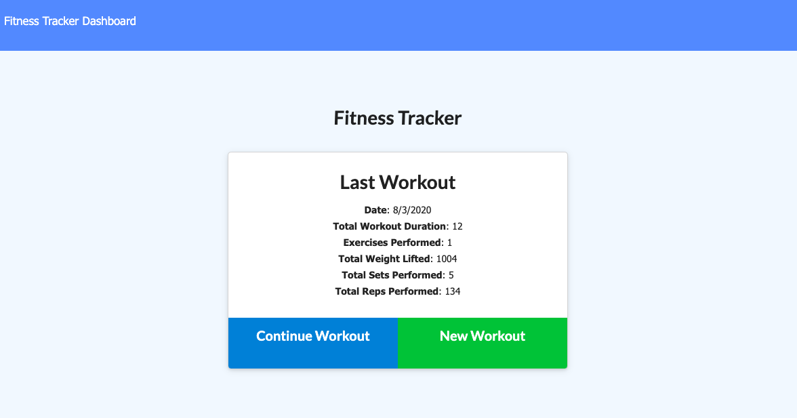
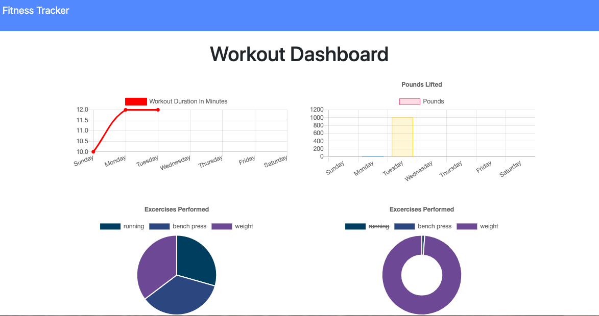

# **Workout Tracker**

This super fun and functional app allows peeps to keep track of their workouts so they can see their progress!!
Look at the cool graphs HAL generates and you will feel super motivated!

## Table of contents

- [Description](#Description)
- [Installation](#Installation)
- [Usage](#Usage)
- [Links](#Links) 
- [Licenses](#Licenses)
- [Contributors](#Contributors)
- [Test](#Test)
- [GitHub Info](#GitHub) 

## Description
         This app uses a Mongo database with a Mongoose schema and handles routes with Express.

## Installation

        npm install 

## Usage

Productivity and health!! 

## Links

- [Deployed App in Heroku](https://arcane-badlands-49617.herokuapp.com/)

## Licenses

## Contributors

## Test

Tests: done and pass with flying colors.

## GitHub

- [GitHub Profile](https://github.com/paulinalo22)
